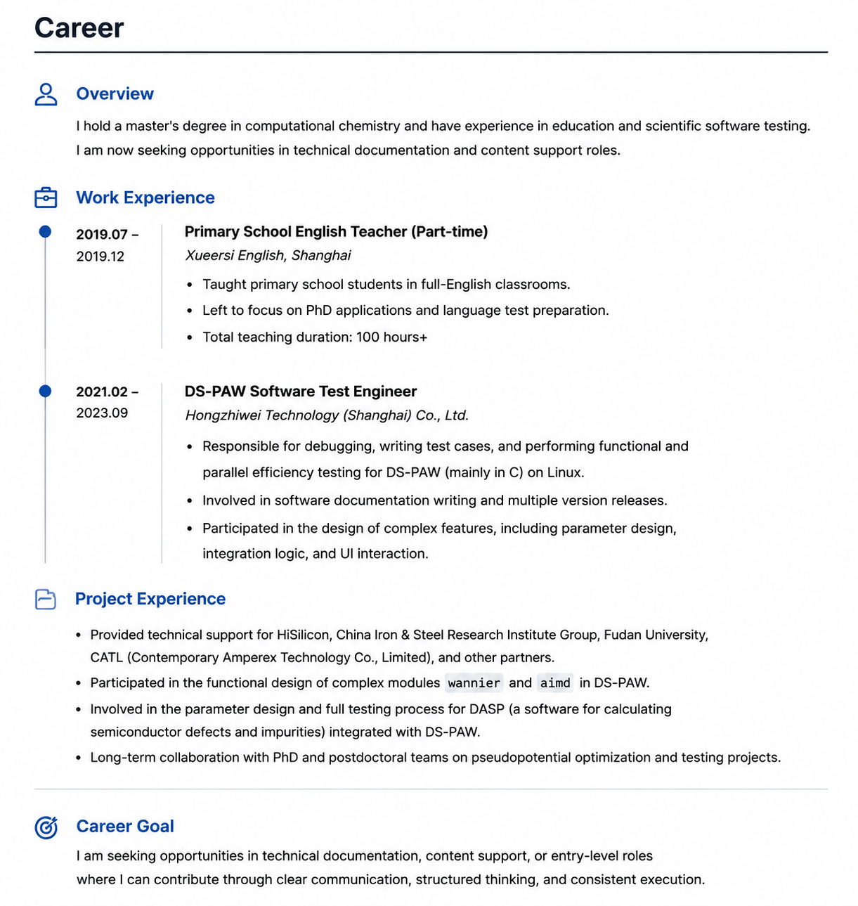

Professional Experience
=========================

This page outlines my professional experience, project work, and career development over the past few years. It also provides context for the self-directed learning period before transitioning to a documentation engineer role.

---

Shanghai Xueersi English | Elementary English Teacher
-----------------------------------------------------

**2019.09 – 2019.12**

- Taught English to elementary school students in a fully English environment.  
- Developed lesson plans, classroom materials, and interactive activities.  
- Left the position due to pursuing PhD applications.
- Total teaching duration: 100 hours +

Hongzhiwei Technology, Shanghai | Software Test Engineer
-----------------------------------------------------

**2021.02 – 2023.09**

- Conducted code debugging and function testing for DS-PAW, a domestic scientific computing software (C language), across three software versions.
- Participated in feature development, including parameter design, integration logic, and UI interactions.
- Maintained and updated software documentation, tracked issues, and ensured version consistency.

---

**Project Experience**

- Supported projects for Huawei HiSilicon, China Iron & Steel Research Institute, Fudan University, CATL, etc.  
- Contributed to the design of DS-PAW’s complex modules, including **Wannier** and **AIMD** functionality.  
- Participated in the full workflow of integrating defect analysis software **DASP** (*a software for calculating semiconductor defects and impurities*)with DS-PAW, including parameter design and testing.  
- Engaged in pseudopotential optimization and testing projects led by PhD and postdoctoral research teams.
