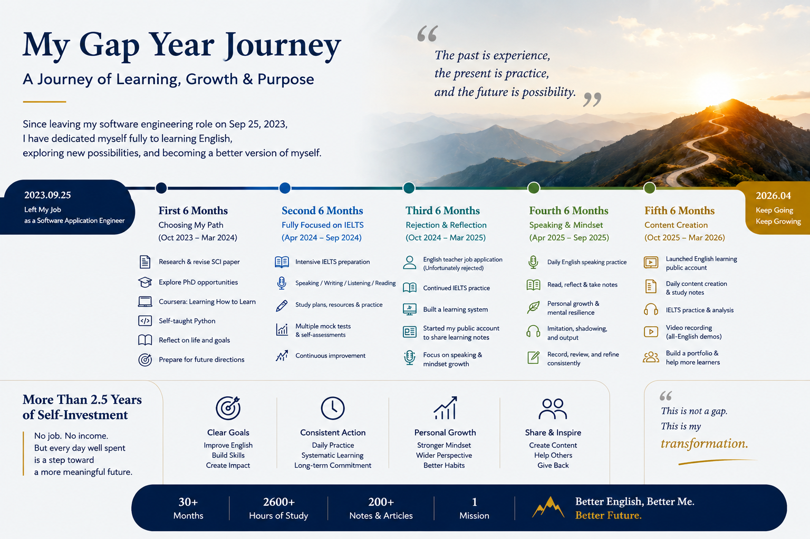

About Me
========

Hello, I'm ZhangYu, graduated from Shanghai University in 2019 with a master's degree in computational chemistry. After three years as a software engineer and two and a half years of self-directed exploration, I've decided to transition to a role as a documentation engineer.

During this gap period, I focused on exploring new directions in my career, building my English skills, and developing structured self-learning systems, as illustrated below:

This period allowed me to:
----------------------------

- Consolidate my English communication skills in reading, writing, listening, and speaking.  
- Develop consistent self-directed learning strategies.  
- Reflect on career goals and transition plans.

.. Developed and maintained technical documentation for scientific software products, including user guides, tutorials, troubleshooting documentation, and parameter references.

.. admonition:: Career Overview
   :class: important

   I am now pursuing opportunities as a documentation engineer or in content support roles.  
   Click below to see a detailed summary of my work experience, project involvement, and professional development.

.. toctree::
   :maxdepth: 1
   :titlesonly:

   career