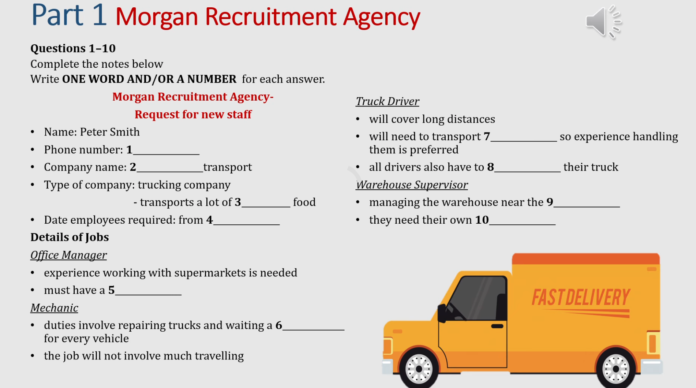

Listening
===========

Focus: 
---------
.. rubric:: real-world comprehension, error pattern recognition, and exposure to authentic English.

- **IELTS Listening Practice: Real Exam Materials**

*Focus*:
    practicing with authentic IELTS listening tests
    improving accuracy, timing, and information extraction skills

.. centered:: `IELTS Listening Practice: Part 1 <https://mp.weixin.qq.com/s/JwSjuFgkolUn73EW6sSpuA>`_ 

- **Podcast-Based Listening Development**  
  
  *Focus*: 
    improving comprehension through authentic and varied listening input  
  
  *Featured Example*:

  .. image:: _static/lis1.png
   :width: 50%
   :align: center

  .. centered:: `How to Change Your Personality to Make Yourself More Confident  <https://mp.weixin.qq.com/s?__biz=Mzg4Nzc2MjI0Mw==&mid=2247485522&idx=1&sn=8c790c62dd66a87fce3ba91e4def4ccc&chksm=cf84347ef8f3bd68d1cac52cff8138351a888379ee97103c35c98e24ae75d4623318d845d4c5&scene=178&cur_album_id=4182241668671684615&search_click_id=#rd>`_ 

- **Intensive Practice: Studio Classroom Advanced Material**  
  
  *Focus*: 
    detailed comprehension of fast, natural speech without transcripts  
  
  *Featured Example*:

  .. image:: _static/lis3.png
   :width: 50%
   :align: center

  .. centered:: `Advanced Listening Practice (Studio Classroom)  <https://mp.weixin.qq.com/s/6DozONpsEH1_mh2FhNrS0A>`_ 

